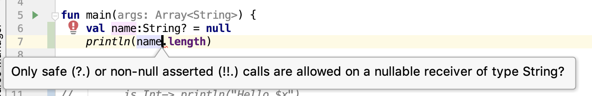

# Kotlin基础

1. var 和 val 

   var 是变量，是可以在初始化之后，再次进行赋值操作的，val 是不可变量，初始化或者赋值之后，再次进行赋值会报错

2. Kotlin中常见的基本数据类型

   ```kotlin
   var aInt: Int = 1
   var aFloat:Float = 2.0F
   var aLong:Long = 3000L
   var aDouble:Double = 3.2143
   var aShort:Short = 123
   var aBbyte:Byte = Byte.MAX_VALUE
   var aBoolean:Boolean = true
   ```

3. 数组和集合

   * 基本类型数组

   ```kotlin
   // 整数数组
   var arrayOfInt:IntArray = intArrayOf(1,3,5,7)
   // 字符数组
   var arrayOfChar:CharArray = charArrayOf('a','b','c')
   // 字符串数组
   var arrayOfString:Array<String> = arrayOf("hello","world")
   ```

   - 对象类型数组

   ```kotlin
   class CityMayor(var name:String){
       init{
          println("init cityMayor")
       }
   }
   var arrayOfMayor:Array<CityMayor> = arrayOf(CityMayor("北京"))
   ```

   - 数组的常见操作

   ```kotlin
   // 数组的连接
   var arrayOfChar:CharArray = charArrayOf('a', 'b','c')
   println(arrayOfChar.joinToString()) // a,b,c
   println(arrayOfChar.joinToString("")) // abc
   println(arrayOfChar.joinToString("|")) // a|b|c
   
   // Returns a list containing elements at indices in the specified [indices] range.
   // 返回一个在指定下标范围内的列表
   var arrayOfInt:IntArray = intArrayOf(1, 3, 5, 7)
   println(arrayOfInt.slice(1..2)) // [3,5]
   println(arrayofChar.slice(0,1)) // [a]
   
   // 截取字符串
   println("hello".slice(0..1)) // he
   println("hello".slice(0 unitl 1)) // h 
   ```

4. 类和构造方法以及初始化

   - kotlin 类初步认识

     ```kotlin
     class Person {
       
     }
     ```

   - kotlin 带有主构造器和次构造器的类

     ```kotlin
     class Person(name:String, age:Int) { // 主构造器
        private var gender:Int = 0
        constructor(name:String, age:Int, gender:Int):this(name, age){ // 次构造器
           this.gender = gender
           println("次构造器执行 $gender")
        }
       
        init { // init 初始化化代码块
           println("init代码块 $name $age")
        }
     }
     
     fun main(args: Array<String>){
        val person = Person("Jack", 18, 1)
        // person.gender 这句执行不了 
     }
     ```

     看下执行main方法后的结构

     ```java 
     init代码块 Jack 18
     次构造器执行 1
     ```

     在创建类的过程中有几个细节需要注意：

     - 在主构造器上 我们可以在变量名前面加上 var 或 val , 也可以不加 但是有区别：加上之后 我们可以直接在类的外部使用`person.name`直接获取到对象的`name`对应的value 如果不加 我们则不能直接获取到对应的属性值    个人认为一般最好加上var 方便时候用
     - 在次构造器上不能加 var 或者 val 
     - 在创建对象的过程中，init代码块先于次构造器先执行
     - 不确定init代码块是比主构造器先执行？？？

   - 关于对象的属性和方法调用

     1. 如果在主构造器上上使用 var 或者 val 声明属性，则我们可以直接使用类似 `person.name`的方式获取属性值 ，如果没有在主构造器上使用var 或者 val 来声明属性，则我们不能获取到对应的属性值

        ```kotlin
        class Cat(var name:String, var age:Int){
        
        }
        
        fun main(args:Array<String>){
           var cat:Cat = Cat("miaomiao", 3)
           println(cat.name) // miao
           println(cat.age)  // 3
           cat.name = "lily"
           println(cat.name) // lily
        }
        ```

     2. 对于在类中声明的成员变量，我们使用 set 和 get 方法 获取和设置属性

        ```kotlin
        class Cat(var name:String, var age:Int){
            var color:String? = null
                set(value) {
                    field = value
                }
                get() {
                    return "体色 $field"
                }
            var gender:Int = 0
                set(value) {
                    field = value
                }
                get() {
                    return field
                }
        }
        
        var cat = Cat("miao", 2)
        cat.color = "黄色"
        cat.gender= 1
        println(cat.color) // 体色 黄色
        println(cat.gender)// 1
        ```

   - 类的继承

     ```kotlin	
     open abstract class Humans(var name: String, var look: String) {
         fun showMe(){
             println("I'am ${name} ,I look like ${look}")
         }
         abstract fun loadHobby():String?
     }
     
     class Male(name: String, look: String) : Humans(name, look) {
         private lateinit var mHobby: String
         constructor(name: String, look: String, hobby: String) : this(name, look) {
             this.mHobby = hobby
         }
         override fun loadHobby(): String? {
             return "I like $mHobby"
         }
     }
     
     class Female (name: String, look: String) : Humans(name, look) {
         private lateinit var mHobby: String
         constructor(name: String, look: String, hobby: String) : this(name, look) {
             this.mHobby = hobby
         }
         override fun loadHobby(): String? {
             return "I like $mHobby"
         }
     }
     
     val male = Male("Jack", "handsome", "play football")
     male.showMe() // I'am Jack ,I look like handsome
     println(male.loadHobby()) // I like play football
     val female = Female("Lily", "beautify", "dance")
     female.showMe()  // I'am Lily ,I look like beautify
     println(female.loadHobby()) // I like dance
     ```

5. 常见的Kotlin符号 （？ ?.   ?:  !!  as is ）

   -  关于问号？表示可为空

     正常情况下，var 声明的变量不能为`null`,且必须初始化，如果想设置为`null`, 则需要在变量类型后面加个问号`?`, 表示可为空

     ```kotlin
     var name:String? = null
     println(name)
     // null  
     
     var name:String
     println(name)
     // error: property must be initialized or be abstract
     // var name:String
     // ^
     // error: variable 'name' must be initialized
     // println(name)
     //        ^
     
     var name:String = null
     println(name)
     //error: null can not be a value of a non-null type String
     //var name:String = null
     ```

   - 关于 ?. 表示不为空 则就使用该属性或者方法 否则就返回null 

   ```kotlin
   class Cat(var name:String){
       fun miao(){
           println("$name say miao~~~")
       }
   }
   
   var cat:Cat?= null
   println(cat?.miao()) // null
   println(cat?.name) // null
   ```

   - 关于 ?: 的使用 A?:B 如果A不为空，则返回自身，如果为空 ，返回B

   ```kotlin
   var name:String? = null
   var result = name?:"Jack"
   println(result)
   // Jack
   var nickname:String = "doudou"
   var result_nick = nickname?:"rose"
   println(result_nick)
   // doudou
   ```

   - 关于 !!的使用 

   ```kotlin 
   val name:String? = null
   //println(name.length) // 这中写法在kotlin中是不允许的 name要么为null要么在在属性length前面加!!.
   println(name!!.length)
   ```

   

   - 关于 as is 的使用 涉及到类型转换问题 

     ```kotlin 
     open class Parent(var name:String){
        open fun sayHi(){
            println("parent $name say hello")
         }
     }
     class Child(name:String, age:Int):Parent(name) {
         override fun sayHi() {
             println("child $name say hello")
         }
     }
     
     val childOne:Parent = Child("Bruce Li", 12)
     if (childOne is Parent){
     }
     if (childOne is Child){
         childOne.sayHi()
     }
     val childTwo:Parent = Parent("Bruce Li")
     if (childTwo is Parent){
         childTwo.sayHi()
     }
     if (childTwo is Child){
         childTwo.sayHi()
     }
     val childThree:Parent = Child("Bruce John", 10)
     val childTFour:Child = childThree as Child
     childTFour.sayHi()
     // Exception in thread "main" java.lang.ClassCastException: com.luckyboy.kotlinlean.Parent cannot be cast to com.luckyboy.kotlinlean.Child
     //    val childFive:Child = childTwo as Child // 不安全的类型转换
     val childFive:Child? = childTwo as? Child // 安全的类型转换
     childFive?.sayHi() // childFive为null 就不执行了 sayHi方法
     ```

     

6. 循环结构 for  和 判断结构  if  when

   循环结构 for 

   - 第一种for 循环

   ```kotlin
   val names = arrayOf("Jack", "Rose", "lily")
       for (name in names){
           println(name)
   }
   // Jack Rose lily
   ```

   - 第二中for循环

   ```kotlin
   var names:Array<String> = arrayOf("Jack", "Rose", "Lily")
   for (i in names.indices){
        println("index is $i and value ${names[i]}")
   }
   //index is 0 and value Jack index is 1 and value Rose index is 2 and value Lily
   ```

   - 第三种 for 循环 

   ```kotlin 
   var names:Array<String> = arrayOf("Jack", "Rose", "Lily")
   names.forEach { 
       println(it)
   }
   // Jack Rose lily
   ```

   - 第四种for 循环

   ```kotlin 
   var names:Array<String> = arrayOf("Jack", "Rose", "Lily")
   names.forEachIndexed { index, s -> 
       println("index ${index} value ${s} ")
   }
   //index 0 value Jack index 1 value Rose index 2 value Lily
   ```

   判断结构 if else 

   -  第一种情况 条件分支语句只有一行

   ```kotlin 
   var a = 10
   var b = 12
   var result = if (a>b) "你猜错了" else  "你猜对了"
   println(result) // 你猜对了
   ```

   - 第二种情况 条件分支语句有多句

   ```kotlin 
   var a = 10 
   var b = 200
   var result = if (a>b){
        println("你死定了")
       "你猜错了"  
   } else{
       println("你好棒啊")
       "你猜对了"  
   }
   println(result)
   // 你好棒啊你猜对了
   ```

   When 语句

   - when语句第一种使用方法  when带参数

   ```kotlin 
   var score = 67
   when (score) {
       in 90..100 -> println("成绩优秀")
       in 80..89 -> println("成绩优良")
       in 60..79 -> println("成绩及格")
       else -> println("成绩不及格")
   }
   // 成绩及格
   ```

   - when第二种使用方法 when不带参数 但是有返回值

   ```kotlin 
   var score = 70
   var comment = when {
       score>=90 -> "成绩优秀"
       score>=80 -> "成绩优良"
       score>=60 -> "成绩及格"
       else -> "成绩不及格"
   }
   println(comment)
   // 成绩及格
   ```

   

7. lateinit 和 by lazy 

   Lateinit 只能用于var   by lazy 只能用于 val 

   ```kotlin 
   class Dog {
       lateinit var name: String
       val color: String by lazy {
           "yellow"
       }
       fun setDogName(name: String){
           this.name = name
       }
   }
   
   var dog = Dog()
   dog.setDogName("dahuang")
   println(dog.color)//yellow
   println(dog.name) //dahuang
   ```

8. 接口相关

   -  kotlin 接口

   ```kotlin
   interface ISwim {
       fun swim()
   }
   
   class Fish:ISwim {
       override fun swim() {
           println("我是鱼 我能游泳")
       }
   }
   
   class Penguin :ISwim {
       override fun swim() {
           println("我是企鹅 我能游泳")
       }
   }
   
   var fish = Fish()
   fish.swim() // 我是鱼 我能游泳
   var penguin = Penguin()
   penguin.swim() //我是企鹅 我能游泳
   ```

   - kotlin 构造方法接口代理  

     构造方法接口代理的意思就是说本来要实现的接口方法被主构造方法中的参数进行了接管，交给它们来进行接口方法的实现

   ```kotlin 
   interface Driver {
       fun drive()
   }
   interface Writer {
       fun write()
   }
   class PPTWriter:Writer {
       override fun write() {
           println("正在写PPT")
       }
   }
   class CarDriver:Driver {
       override fun drive() {
           println("正在开车")
       }
   }
   class SeniorManager(var driver:Driver, var writer:Writer):Driver by driver,Writer by writer{
     
   }
   
   var driver = CarDriver()
   var writer = PPTWriter()
   var seniorManager = SeniorManager(driver, writer)
   seniorManager.drive() // 正在开车
   seniorManager.write() // 正在写PPT
   ```

   - kotlin 属性代理

     一旦通过by来声明一个变量 实际就是一个傀儡 真正的实现是在代理的get方法中实现

   ```kotlin 
   /* 成员变量代理 */
   class Delegates {
       val hello by lazy {
           "hello wolrd"
       }
       val hello2 by X()
       var hello3 by X()
   }
   // 代理对象需要实现set和get方法
   class X {
        private var value:String?=null
        operator fun getValue(thisRef: Any?, property: KProperty<*>): String {
            println("getValue: $thisRef->${property.name} ")
            return value ?: ""
        }
       operator fun setValue(thisRef: Any?, property: KProperty<*>, value:String) {
           println("setValue: $thisRef->${property.name}=$value")
           this.value = value
       }
   }
    
   val delegates = Delegates() 
   println(delegates.hello) // hello wolrd
   println(delegates.hello2)// getValue: Delegates@41629346->hello2 
   println(delegates.hello3)// getValue: Delegates@41629346->hello3 
   delegates.hello3 = "hello world value3" // setValue: Delegates@41629346->hello3=hello world value3
   println(delegates.hello3) // getValue: Delegates@41629346->hello3  // hello world value3
   
   ```

9. 枚举

   ```kotlin 
   enum class SEASON{
       SPRING,
       SUMMER,
       AUTUMN,
       WINTER
   }
   
   for (item in SEASON.values()){
       println(item.name)
   }
   // SPRING SUMMER AUTUMN WINTER
   ```

10. 方法扩展

    下面的例子就是给已有的类添加一些新的方法来实现某些功能  比如给字符串重复指定次数拼成字符串

    ```kotlin 
    fun String.multiply(int:Int):String{
        val stringBuilder = StringBuilder()
        for (i in 0 until int){
            stringBuilder.append(this);
        }
        return stringBuilder.toString()
    }
    
    val result = "abc".multiply(3)
    println(result)  // abcabcabc
    ```

11. 单例的实现

12. 密封类Sealed Class

13. 伴生对象 companion 

14. @JvmField 和 @JvmStatic

15. internal 关键字是什么意思

16. inner 内部类是什么意思

17. inline 是什么意思

18. 高阶函数一 :  函数引用 

19. 高阶函数二：map fold  foldRight filter filterIndexed takeWhile

20. use 是什么意思

21. apply, let , run 是什么意思

22. with 是什么意思

23. 尾递归

24. observable和map操作

25. 科利华是啥东西

26. 协程相关

